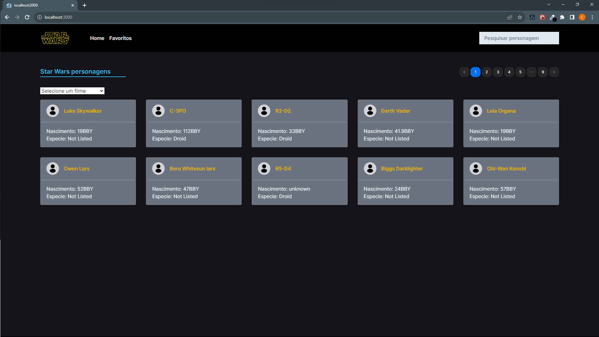
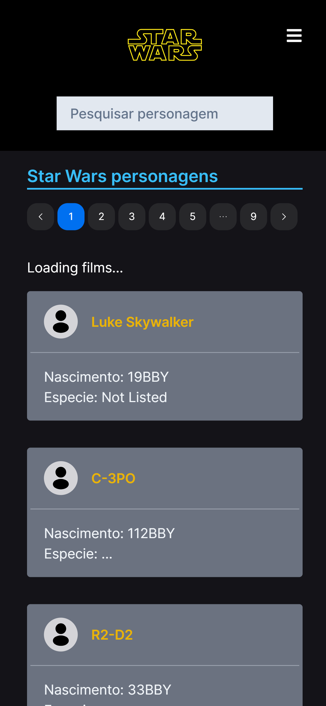
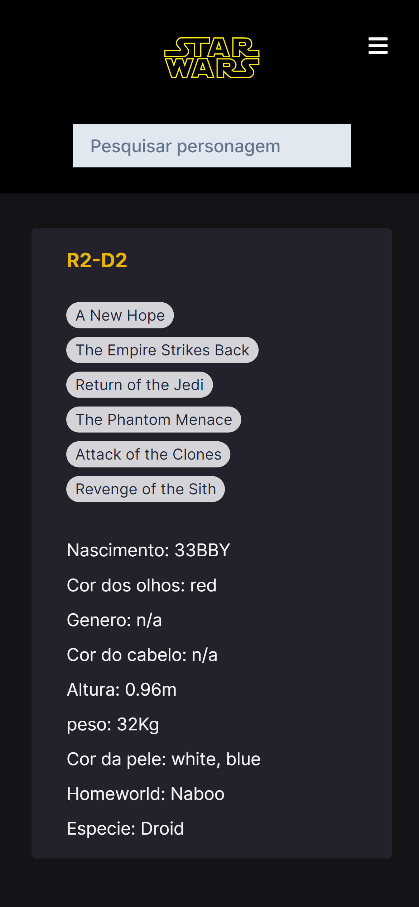

# SWAPI Project

pt-br

### Desafio técnico para a Estoa com página de personagens Star Wars

## Introdução

Este é um projeto baseado na Api do star wars SWAPI, Single Page Application com diversos features feito em Nextjs garantindo uma ótima experiencia de usuário e com diversas boas práticas do desenvolvimento web.

O projeto foi desenvolvido em NExtJs, Tailwind Css, TypeStript e gerenciamento de estados globais com o Redux js, contando com as melhores práticas buscando performace, bons visuais e layout totalmente responsivo. As principais ferramentas utilizadas são: Nexts, React Js, Redux, TypeStript, rotas dinamicas para cada personagem, Tailwind Css, leitura de endpoints da API SWAPI, Axios, React Icons, Hooks Customizados, useState e useEffect, componentes do Next UI.

### Principais funcionalidades:

- Navegação suave entre as páginas com o Single page application
- Listagem dos Personagens de Star Wars a partir dos dados da api
- estado de loading modelo esqueleto do Next UI
- Filtro dos personagens por nome
- Filtro dos personagens por Filmes
- Página para cada personagem com todos os detalhes
- Layout totalmente responsivo

### Obrigado por conferir o projeto!

---

### Mobile home

### Mobile description page

## Instalação:

    Para Instalar a aplicação localmente, clone o repositorio e se sertifique de ter o node instalado.
    Entre na pasta swapi-project com o comando cd ./swapi-project 
    
    - No terminal execute:
    
     - npm install
     - npm run dev

## Techs:

 

  
  
  
   
  

 

### Developer: Cléber Severo

 
 

 
